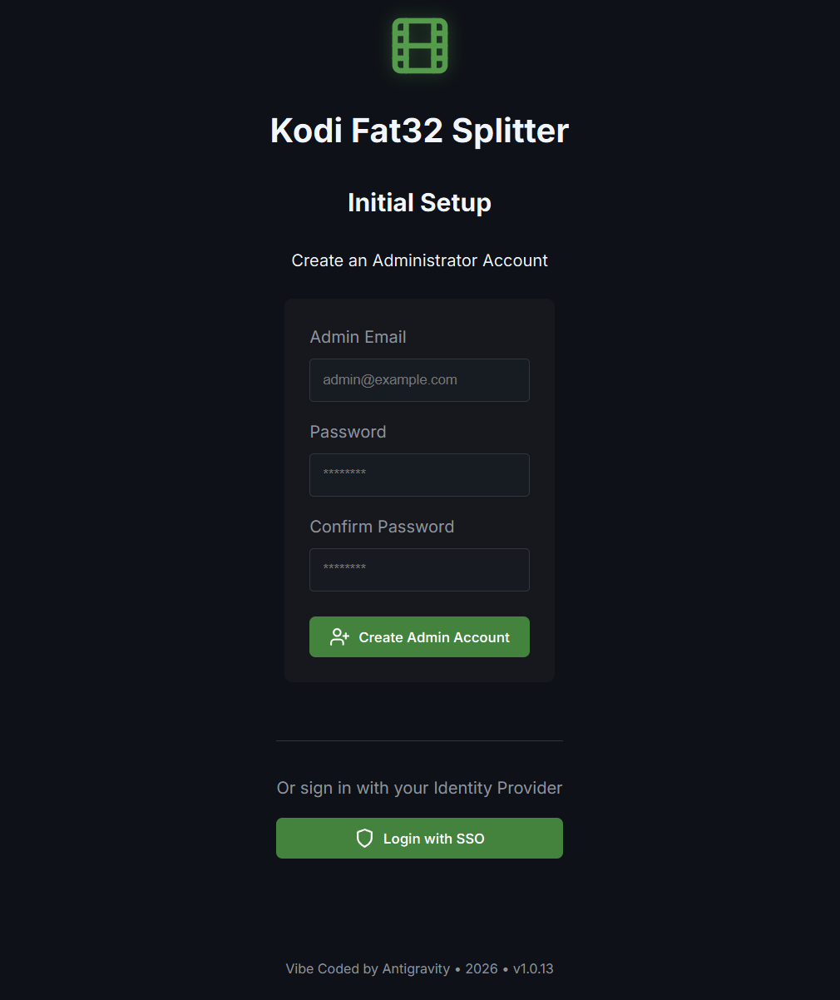
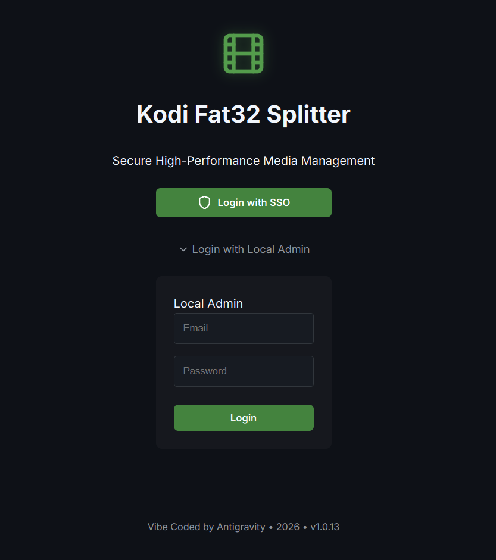
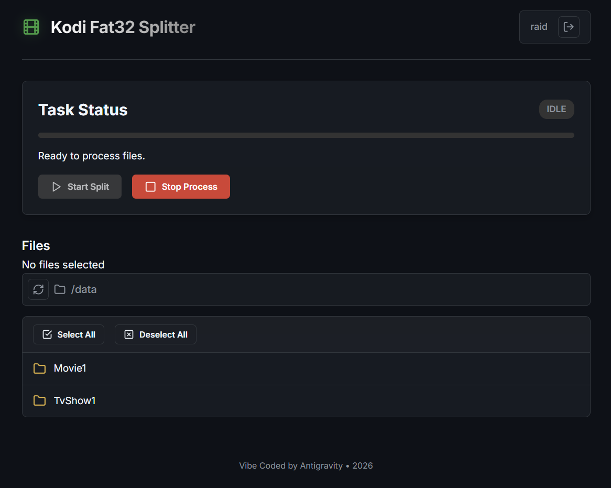
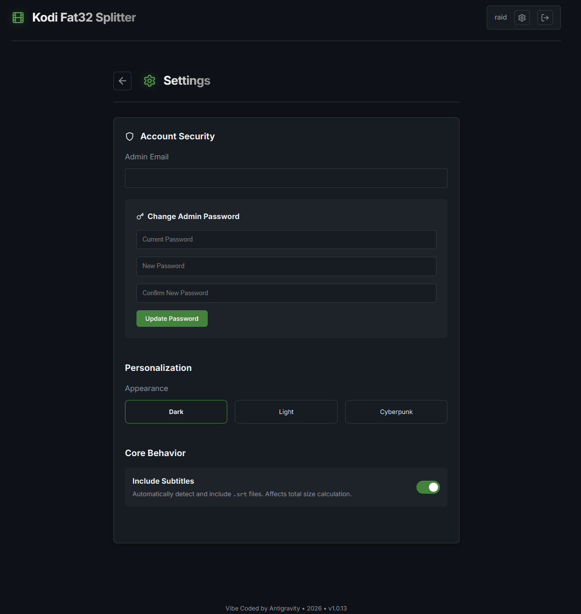

# 🎬 Kodi Fat32 Splitter

A modern, secure, and high-performance web dashboard designed to bridge the gap between large 4K/MKV media collections and **FAT32-formatted** drives. Now rewritten with a **React** frontend and secured with **OIDC Authentication**.


<table align="center">
  <tr>
    <td align="center" valign="bottom" width="50%">
      
      <br />
      <b>Initial Setup</b>
    </td>
    <td align="center" valign="bottom" width="50%">
      
      <br />
      <b>Login Page</b>
    </td>
  </tr>
  <tr>
    <td align="center" valign="bottom">
      
      <br />
      <b>Main Interface</b>
    </td>
    <td align="center" valign="bottom">
      
      <br />
      <b>Settings Page</b>
    </td>
  </tr>
</table>
---

## 🚀 Key Features

- **🛡️ Secure Access**: Integrated OIDC Authentication (via Pocket-ID, Keycloak, etc.) to keep your dashboard private.
- **📂 Smart Navigation**: Clean, reactive file browser with breadcrumbs, multi-select, and bulk actions.
-   **Format Support**: Handles `.mkv` and `.mp4` files (Large MKV/MP4 -> 4GB FAT32 chunks).
- **⚡ Bit-Perfect Splitting**: Splits files into 4GB segments (Store mode `-m0`) with zero re-compression.
- **🔄 Fault-Tolerant**: Self-cleaning workflow that handles interruptions and locks robustly.
- **🎨 Modern UI**: Built with **React (Vite)** and **Tailwind-like CSS**, featuring dark mode, animations, and real-time status updates.

---

## 🚀 Quick Start (Docker Image)

The easiest way to run the application is using the pre-built Docker images.

1.  **Download Files**:
    *   Download `docker-compose.release.yml` and rename it to `docker-compose.yml`.
    *   Download `.env.example` and rename it to `.env`.

2.  **Configure Volumes**:
    Open `docker-compose.yml` and update the volume mapping to point to your media folder:
    ```yaml
    volumes:
      - "/path/to/your/movies:/data" # <--- IMPORTANT: Change this to your actual media folder!
    ```

3.  **Configure `.env`**:
    By default, `OIDC_AUTH=false` is set. The first time you launch the app, you will be asked to create a **Local Admin** account.
    If you want to enable OIDC, open `.env`, set `OIDC_AUTH=true`, and fill in your provider details (see [Authentication & Configuration](#-authentication--configuration) for details).

4.  **Run**:
    ```bash
    docker-compose up -d
    ```

---

## 🛠️ Architecture

### Frontend
- **Framework**: React 18 + Vite
- **Styling**: Custom CSS3 (Glassmorphism & Cyberpunk aesthetic)
- **Auth**: `react-oidc-context` for PKCE flow
- **State**: Real-time polling via Axios

### Backend
- **Core**: FastAPI (Python 3.11)
- **Engine**: Official `rar` CLI (Linux x64)
- **Server**: Nginx (serving frontend & proxying API)

---

## 🔐 Authentication & Configuration

This project supports **OpenID Connect (OIDC)** for authentication. If you don't have an OIDC provider, it defaults to **Local Authentication Mode** where you create an admin account during setup.

### Configuration via Environment File
Configuration is handled via a `.env` file in the root directory.

1.  **Edit `.env`** with your provider details:
    ```ini
    OIDC_AUTH=true
    OIDC_AUTHORITY=https://auth.yourdomain.com
    OIDC_CLIENT_ID=your-client-id
    ```
    > [!IMPORTANT]
    > **PKCE Requirement**: You must configure your Identity Provider's client (e.g., Pocket ID, Keycloak) as a **Public Client** (confidentiality disabled) and enable **Standard Flow** + **Direct Access Grants** (if applicable), but most importantly **PKCE**.

2.  **Start the stack** (Docker Compose automatically reads the `.env` file):
    ```bash
    docker-compose up -d
    ```

#### Disable OIDC (Local Authentication)
To use a local admin account instead of OIDC, set `OIDC_AUTH=false` in your `.env` file. You will be prompted to create an admin account on the first run.

---

## 🔒 Security Configuration

### SECRET_KEY (JWT Signing)

The `SECRET_KEY` is used to sign JWT tokens for local authentication. **For production, you should generate a strong random key.**

> [!IMPORTANT]
> If `SECRET_KEY` is not set, a random key is generated at startup. This means tokens will be invalidated after every container restart.

**Generate a secure key:**

**Linux/macOS:**
```bash
openssl rand -hex 32
```

**Windows (PowerShell):**
```powershell
-join ((1..32) | ForEach-Object { '{0:x2}' -f (Get-Random -Maximum 256) })
```

Add it to your `.env`:
```ini
SECRET_KEY=your-generated-key-here
```

### Setup Endpoint Auto-Disable

The `/api/setup` endpoint automatically disables itself once an admin account with a password is configured. 

**To reset and start fresh:**
1. Stop the container
2. Delete `config/settings.json`
3. Restart the container

## 🚦 Getting Started (Development)

### 1. Requirements
- [Docker](https://www.docker.com/get-started)
- [Docker Compose](https://docs.docker.com/compose/install/)

### 2. Deployment
Clone the repo and configure your media directory:

```bash
git clone https://github.com/raidolo/kodi_fat32_splitter.git
cd kodi_fat32_splitter
```

Edit `docker-compose.yml` to point to your movies and set up auth:
```yaml
# docker-compose.yml
services:
  backend:
    volumes:
      - "/path/to/your/movies:/data"  # <--- Update this path
```

Launch the stack:
```bash
docker-compose up -d --build
```

### 3. Usage
1.  Open `http://localhost` (or your server IP).
2.  **Login** via your OIDC provider (if enabled).
3.  **Browse** your folders using the file navigator.
4.  **Select** one or multiple MKV files.
5.  Click **"Start Split"**.
6.  Monitor progress in real-time. The app will generate `.partX.rar` files next to your media.

---

## 👨‍💻 Developer Notes
This repository was refactored from a vanilla JS prototype to a robust React application.
- **Runtime Config**: The frontend container uses an `entrypoint.sh` script to inject environment variables into `window._env_` at startup, allowing you to change auth settings without rebuilding the image.
- **Multi-Select**: The UI supports batch processing — select multiple files, and the backend handles the queue.

> [!TIP]
> **Performance**: The app uses `rar` with `-m0` (Store), meaning it's limited only by your drive's I/O speed.

---

## 📜 License
*Note: This project provides a wrapper for the `rar` utility. Please ensure you comply with the [RAR License](https://www.rarlab.com/license.htm).*

---

> [!NOTE]
> This entire repository was designed and implemented using **Vibe Coding** by **Antigravity**.
